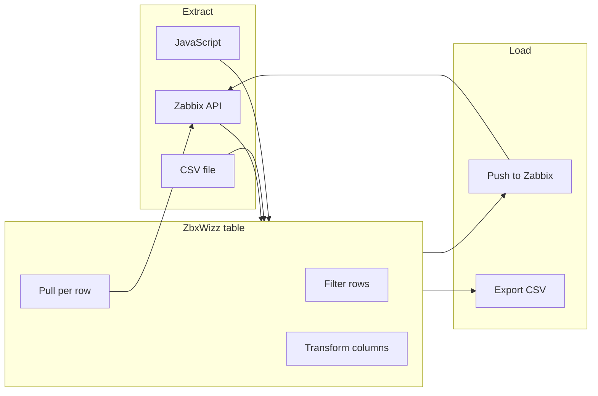

# ZbxWizz documentation

ZbxWizz is a browser-based ETL workbench for [Zabbix](https://www.zabbix.com): import configuration data, transform it in a spreadsheet-like table, enrich rows with extra API calls, and push changes back — or export to CSV.

It is a personal project built for real migration and bulk-update work. You compose the Zabbix API requests; the tool handles the table, batching, previews, and round trip.

**Website:** [zbxwizz.app](https://zbxwizz.app) · **Source:** [GitHub](https://github.com/WebwerksRo/zbxwizz)

---

## How it fits together

Typical workflow:

1. **Import** hosts, items, triggers, or any API resource into a sheet
2. **Filter** down to the rows you care about
3. **Transform** columns with JavaScript (optional)
4. **Pull** extra API data per row (optional)
5. **Push** updates or deletes back to Zabbix, or **export** for Excel

---

## Documentation index

| Guide | What you'll learn |
|-------|-------------------|
| [Installation](installation.md) | Local try-out, Zabbix frontend deployment, upgrades |
| [Getting started](getting-started.md) | Connect, import hosts, transform tags, push back |
| [User interface](user-interface.md) | Menu bar, table layout, sheets, selection, persistence |
| [Import & export](import-export.md) | Zabbix, CSV, JavaScript import; CSV export |
| [Zabbix operations](zabbix-operations.md) | Pull and Push — templates, variables, safety |
| [Transformations](transformations.md) | Column expressions, context objects, cross-sheet lookups |
| [Examples](examples.md) | Copy-paste recipes for common tasks |
| [For maintainers](../static/assets/vendor/README.md) | Updating vendored JavaScript libraries |

---

## Prerequisites

- A Zabbix installation with API access
- An API token (*Users → API tokens* in the Zabbix UI)
- Basic familiarity with the [Zabbix API](https://www.zabbix.com/documentation/current/en/manual/api)
- For in-app transforms: minimal JavaScript (single-line expressions)

---

## Quick links

- [Zabbix API reference](https://www.zabbix.com/documentation/current/en/manual/api)
- [Report issues](https://github.com/WebwerksRo/zbxwizz/issues)
- [Discussions](https://github.com/WebwerksRo/zbxwizz/discussions)

---

## Author

**Sergiu Voicu** — questions and pull requests welcome on GitHub.
